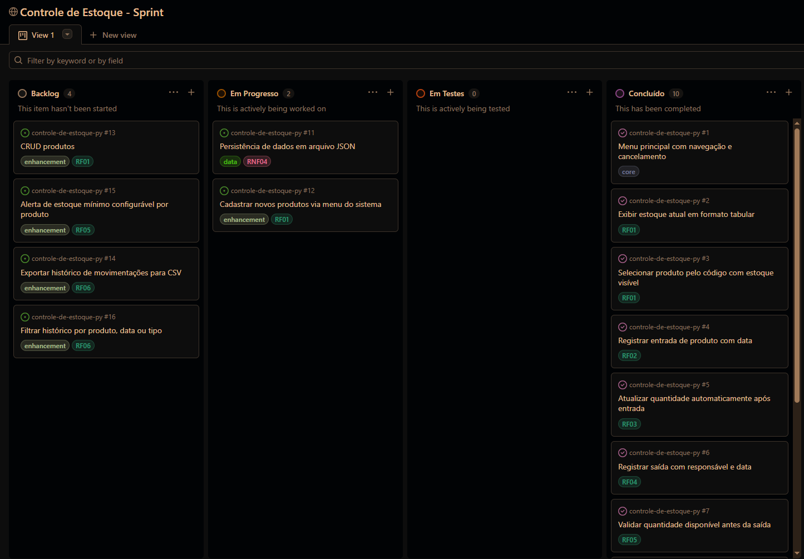

# Quadro Kanban — Controle de Estoque

## Introdução

Este documento representa o quadro de acompanhamento de tarefas do projeto, organizado segundo a metodologia ágil **Scrum**. As tarefas foram derivadas diretamente das histórias de usuário (HU-01 e HU-02) e dos requisitos funcionais e não funcionais levantados para o sistema.

O quadro está dividido em quatro colunas que refletem o ciclo de vida de cada tarefa:

| Coluna              | Significado                                   |
| ------------------- | --------------------------------------------- |
| 📋 **Backlog**      | Tarefas identificadas mas ainda não iniciadas |
| 🔄 **Em Progresso** | Tarefas atualmente em desenvolvimento         |
| 🔍 **Em Testes**    | Tarefas concluídas aguardando validação       |
| ✅ **Concluído**    | Tarefas finalizadas e validadas no código     |

As tarefas marcadas como ✅ **Concluído** foram cruzadas com a implementação atual em `estoque.py` e estão devidamente implementadas. As tarefas em 📋 **Backlog** representam evoluções naturais do sistema que não fazem parte do escopo atual, mas são coerentes com os requisitos levantados.

---

## Quadro de Tarefas interativo

Acesse o board em tempo real no [GitHub Projects →](https://github.com/users/GisellePegado/projects/1)

## Snapshot atual

> Atualizado em: 16/04/2026
